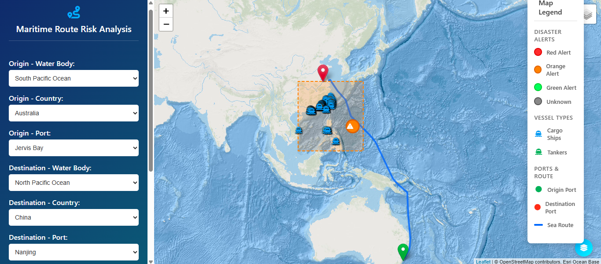
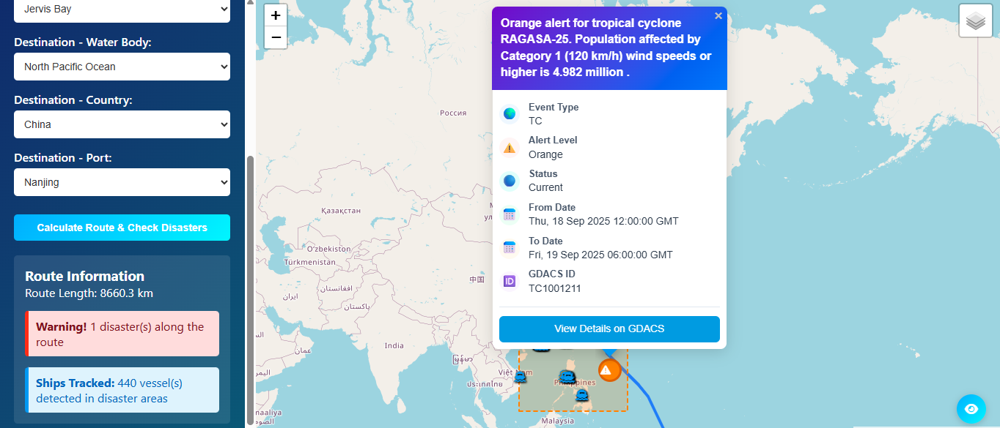
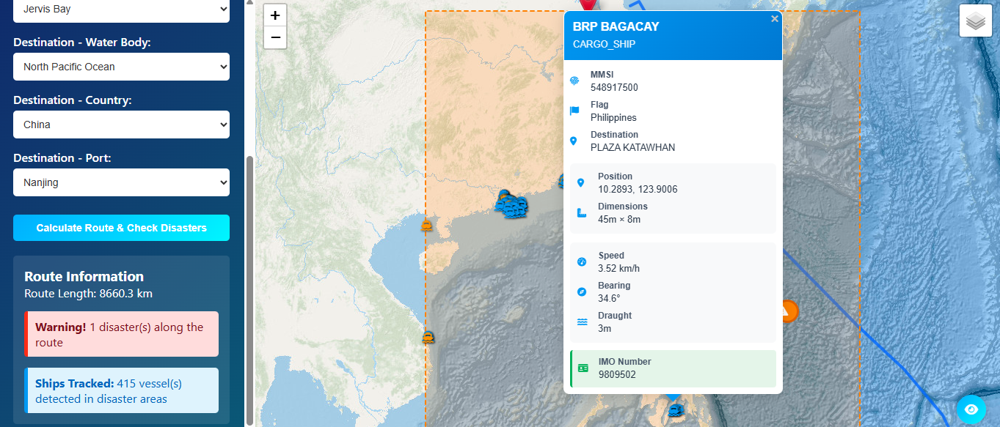
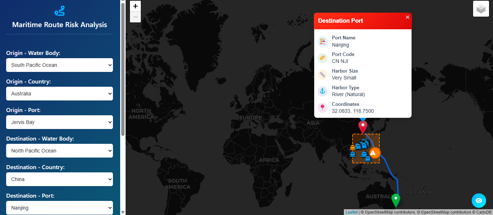

# Maritime Route Risk Analysis and Vessel Tracker

The Maritime Route Risk Analysis and Vessel Tracker project is an integrated platform designed to enhance maritime safety and operational efficiency through real-time vessel monitoring and comprehensive risk assessment. This system combines two powerful applications that work together and provide users with critical information for decision making in maritime operations.

## Project Components

### 1. Port Data Processing Script (data-process)

A utility for converting World Port Index data from the National Geospatial-Intelligence Agency (NGA) into a standardized CSV format.

#### Usage
```bash
# Download source data
wget "https://msi.nga.mil/api/publications/download?type=view&key=16920959/SFH00000/UpdatedPub150.csv" -O UpdatedPub150.csv

# Process the data
python process_ports.py UpdatedPub150.csv
```

#### Output Format
The script generates `port_details.csv` with standardized columns including port names, UN/LOCODE identifiers, coordinates, and harbor specifications.

### 2. Marine Vessel Tracker (Ship Tracker)

A standalone web application for real-time vessel tracking across predefined ocean regions.

## Ship Tracker Interface


*Real-time vessel monitoring with interactive map*

#### Features
- Interactive satellite map view
- Region-based vessel filtering
- Cargo ship and tanker identification
- Comprehensive vessel details

#### Quick Start
```bash
python app.py
```
Navigate to `http://localhost:5000` and select an ocean region to view vessels.

### 3. Maritime Route Risk Analysis System

The main application - a comprehensive route planning system with integrated disaster monitoring and risk assessment.

## Route Risk Interface

| | |
| :---: | :--- |
|  |  |
| *Shipping route and disaster with 415 vessels tracked* | *Event details with source information* |
|  |  |
| *Details of vessels in disaster vicinity* | *Port details with CartoDB map setting* |

### Core Features

**Interactive Route Planning**
- Port selection organized by water body and country
- Calculated sea route visualization
- Distance and travel metrics

**Real-Time Disaster Monitoring**
- GDACS integration for global disaster events
- Multi-category disaster types (earthquakes, cyclones, floods, volcanoes, droughts, wildfires)
- Color-coded alert levels (Red, Orange, Green)
- Proximity-based risk assessment

**Vessel Tracking Integration**
- AIS data via MarinePlan API
- Ships tracked in disaster-affected areas
- Detailed vessel information (MMSI, flag, destination, specifications)

**Risk Analysis**
- Origin, destination, and route-based assessments
- Configurable proximity thresholds
- Visual risk indicators and comprehensive reporting

### Technology Stack

**Backend**
- Flask web framework
- pandas for data processing
- searoute library for maritime routing
- requests for API integration
- lxml for XML processing

**Frontend**
- Leaflet.js interactive mapping
- Multiple tile layer providers
- Responsive CSS design
- AJAX for asynchronous loading

**External Integrations**
- GDACS RSS feed for disaster data
- MarinePlan AIS for vessel tracking
- Multiple geospatial service providers

## Installation

### Prerequisites
- Python 3.8+
- pip package manager
- MarinePlan API key

### Setup Process

1. **Repository Setup**
   ```bash
   git clone https://github.com/VDB11/Maritime-Route-Risk-Analysis.git
   ```

2. **Install Dependencies**
   ```bash
   pip install -r requirements.txt
   ```

3. **Environment Configuration**
   Create `.env` file:
   ```env
   MARINEPLAN_API_KEY=your_api_key_here
   ```

4. **Data Preparation**
   Ensure `port_details.csv` exists with required columns:
   - `port_code`, `port_name`, `water_body`, `country_code`
   - `lat`, `lon`, `harbor_size`, `harbor_type`

5. **Launch Application**
   ```bash
   python run.py
   ```
   Access at `http://localhost:5000`

## Configuration Options

Key settings in `config.py`:
- `DISASTER_PROXIMITY_THRESHOLD`: Distance threshold for risk assessment (default: 100km)
- `SHIP_MAX_AGE`: Maximum age for vessel data (default: 1800 seconds)
- `SHIP_TYPES_FILTER`: Vessel types to display (default: cargo ships, tankers)

## Usage Workflow

### Route Planning Process
1. Select origin port (water body → country → specific port)
2. Select destination port using same hierarchy
3. Calculate route and view risk assessment
4. Review disaster alerts and vessel information

## Data Sources
- GDACS (Global Disaster Alert and Coordination System)
- MarinePlan AIS Network
- World Port Index

## Project Structure
```
Maritime-Route-Risk-Analysis/
├── app.py                 # Main Flask application
├── config.py             # Configuration settings
├── run.py               # Application entry point
├── requirements.txt     # Dependencies
├── searoutes.py        # Route calculations
├── disaster.py         # GDACS integration
├── ships.py           # Vessel tracking
├── .env                # Environment variables
├── .gitignore         # Git ignore rules
├── README.md          # Project documentation
├── Maritime Route Risk - User Document.pdf  # User manual
├── port_details.csv   # Port database
├── data-process/
│   ├── process_ports.py   # Port data processing
│   └── config.json       # Processing configuration
├── Ship Tracker/        # Ship tracking submodule
│   ├── app.py          # Ship tracker Flask app
│   ├── .env           # Tracker environment variables
│   ├── filtered_vessels.json  # Tracker vessel data
│   ├── ocean_regions.csv     # Ocean regions data
│   ├── static/
│   │   └── style.css   # Tracker styles
│   └── templates/
│       └── index.html  # Tracker interface
└── templates/
    └── map.html       # Main frontend interface
```

## Troubleshooting

### Common Issues

**Route Calculation Failures**
- Verify port codes in the data
- Check sea route accessibility
- Confirm internet connectivity

**Missing Disaster Data**
- Test GDACS RSS feed access
- Validate XML parsing logic
- Review proximity thresholds

**Vessel Data Problems**
- Confirm API key configuration
- Check rate limits and quotas
- Verify coordinate formats

## 📝 Contact and License

For any feedbacks or suggestions:
- **Author**: [Vishal Bharadwaj](https://github.com/VDB11)
- **Email**: <vishaldb11@gmail.com>

This project uses open data sources. Please ensure compliance with the following when forking or modifying:
- MarinePlan API usage policies and limits
- GDACS RSS feed usage terms
- National Geospatial-Intelligence Agency's WPI data licensing terms

